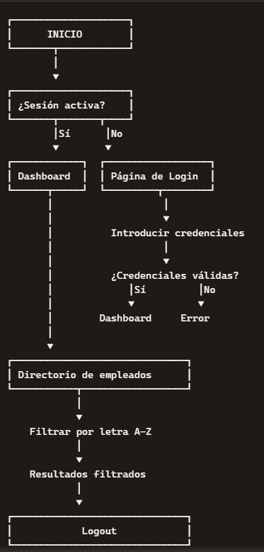
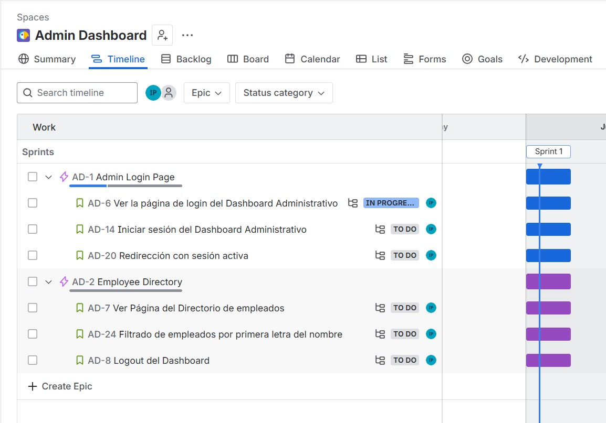
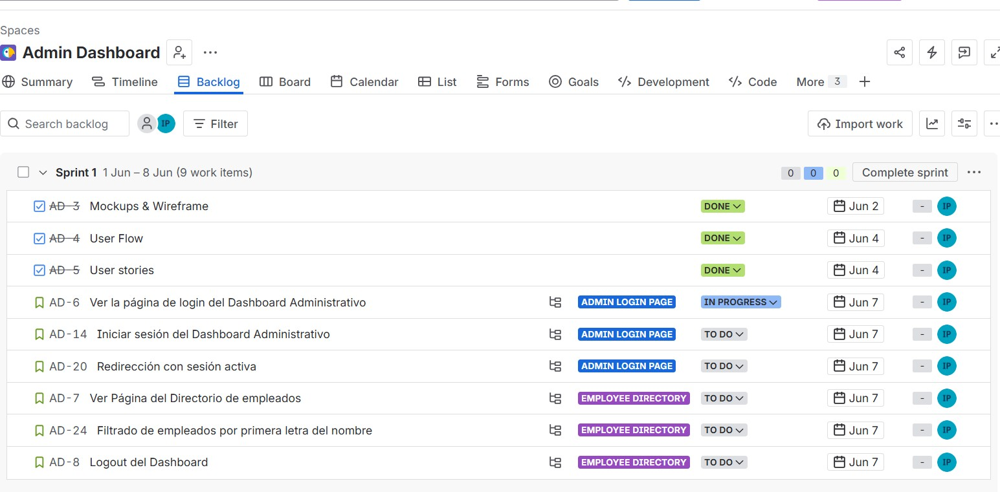
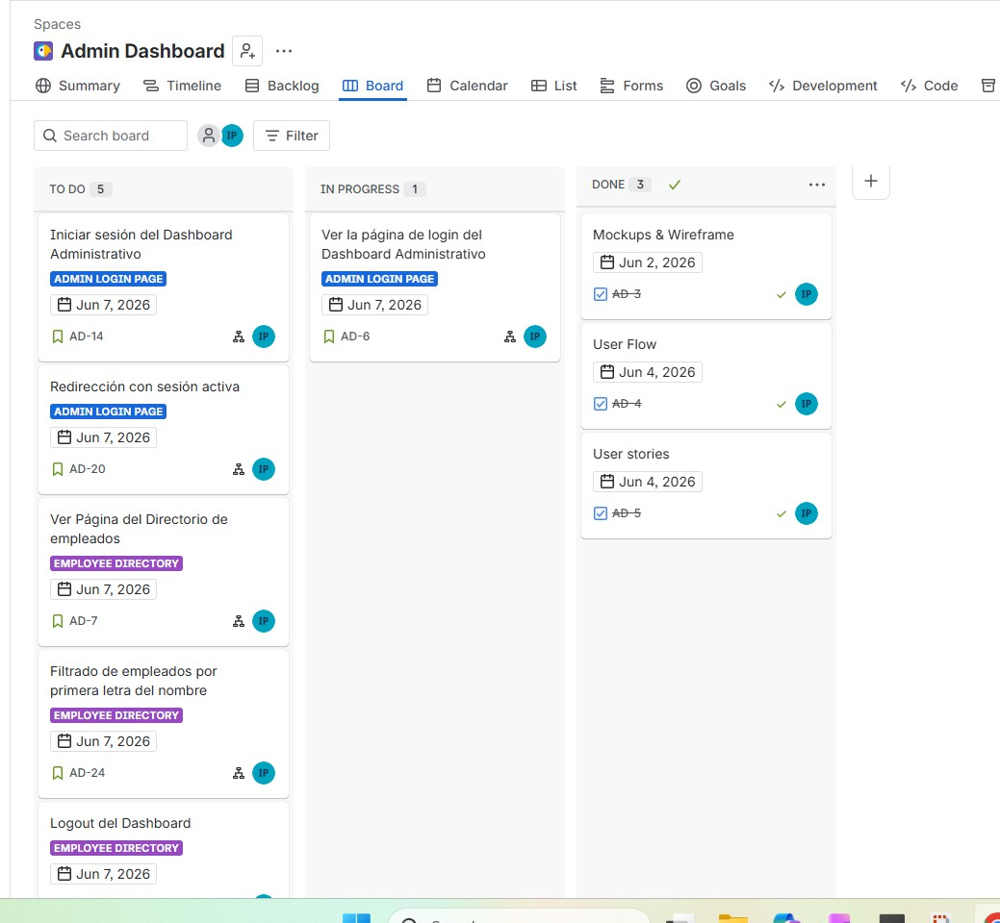
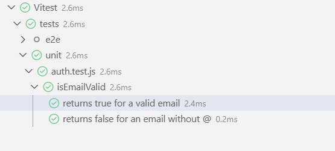
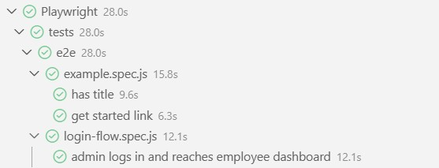

# 📌 Employee Admin Dashboard

Aplicación web dinámica de tipo dashboard administrativo para la gestión de empleados, desarrollada como proyecto de bootcamp.

## 🚀 Descripción
Este proyecto simula un **dashboard administrativo** que permite:

- Iniciar sesión mediante email y contraseña.
- Visualizar un **directorio de empleados** obtenido desde una API externa.
- **Filtrar empleados** por la primera letra del nombre.
- Gestionar la **sesión** (login/logout) usando `localStorage`.
- Navegar en una interfaz **responsive** para mobile y desktop.

---

## 🛠️ Tecnologías
- **HTML5**  
- **CSS3 / SASS**  
- **JavaScript (vanilla)**  
- **Vitest** (tests unitarios)  
- **Playwright** (E2E)  
- **Git & GitHub**  
- **GitHub Pages** (deploy)
- **Gestión y Diseño:** Jira, Figma, Stitch**  


---

## 🎨 Prototipado  
- [Wireframe](https://www.figma.com/design/oEAZgDLJN63TCt210Kp5bO/Admin-Dashboard?node-id=4-2&t=aAk9kxflGSTz8Ox8-1)
- [Mockups mobile](https://www.figma.com/proto/oEAZgDLJN63TCt210Kp5bO/Admin-Dashboard?node-id=28-35&p=f&t=X3jE1koTT0kqZFJU-0&scaling=min-zoom&content-scaling=fixed&starting-point-node-id=28%3A35&show-proto-sidebar=1)
- [Mockups desktop](https://www.figma.com/proto/oEAZgDLJN63TCt210Kp5bO/Admin-Dashboard?node-id=28-90&p=f&t=X3jE1koTT0kqZFJU-0&scaling=min-zoom&content-scaling=fixed&starting-point-node-id=28%3A90&show-proto-sidebar=1)

---

## 🔄 User Flow
- 

---

## 🚀 Planificación
- 
- 
- 


## 📋 Historias de Usuario

---

### 🟦 Ver la página de login del Dashboard Administrativo
**Como** usuario administrador  
**Quiero** ver la página de inicio de sesion 
**Para** saber donde introducir mis credeciales 

**Criterios de aceptación**
- Dado que el usuario administrador accede a la página de inicio de sesión 
- Cuando la página se carga correctamente 
- Entonces el usuario administrador debe ver los campos de email,   contraseña, y el botón de “Login”  

**Subtareas**
- Crear estructura y estilos de la página de login 

---

### 🟦 Iniciar sesión del Dashboard Administrativo
**Como** usuario administrador  
**Quiero** iniciar sesión con mi email y contraseña  
**Para** acceder al dashboard administrativo  

**Criterios de aceptación**
- Dado que el usuario administrador está en la página de iniciar sesión
- Cuando introduce su email y contraseña y pulsa Login  
- Entonces el sistema tiene que validar sus credenciales
- Y si son correctas, accede al dashboard
- Y si son incorrectas, ve un mensaje de error

**Subtareas**
- Acceso al dashboard mediante email y contraseña  
- Validación de email  
- Validación de contraseña
- Creacion boton 'Login' activo
- Guardar sesión en `localStorage`  

---

### 🟦 Redirección con sesión activa
**Como** usuario administrador  
**Quiero** ser redirigido automáticamente al dashboard si ya tengo sesión activa  
**Para** evitar iniciar sesión de nuevo  

**Criterios de aceptación**
- Dado que el usuario tiene una sesión activa 
- Cuando accede a la página de inicio
- Entonces el sistema lo redirige directamente al dashboard administrativo

**Subtareas**
- Estructura y estilos de la página de sesión activa  
- Control de sesión y redirección automática  

---

### 🟦 Ver página del Directorio de empleados
**Como** usuario administrador autenticado  
**Quiero** ver un listado de empleados  
**Para** consultar su información básica de contacto  

**Criterios de aceptación**
- Dado que el usuario administrador está en la página del Directorio de empleados 
- Cuando la página carga con los datos del API  
- Entonces se muestra un listado de empleados con su avatar (aleatorio o según `id`), nombre completo, email y dirección 

**Subtareas**
- Estructura y estilos de la página  
- Diseño de la tarjeta de empleado  
- Obtener datos de la API  
- Mapear datos de la API  
- Generar avatar o añadir foto  

---

### 🟦 Filtrado de empleados por primera letra del nombre
**Como** usuario administrador  
**Quiero** filtrar empleados por la primera letra del nombre  
**Para** encontrar más rápido a un empleado concreto  

**Criterios de aceptación**
- Dado que el usuario administrador está en el Directorio de empleados 
- Cuando selecciona una letra para filtrar
- Entonces se muestran únicamente los empleados cuyo nombre empieza por esa letra

**Subtareas**
- Estructura y estilos del filtro
- Interacción para seleccionar una letra  
- Actualización dinámica del listado  
- Mostrar mensaje “No hay empleados con esta letra”  
- Resetear filtro (mostrar todos los empleados)  

---

### 🟦 Logout del Dashboard
**Como** usuario administrador autenticado  
**Quiero** cerrar sesión desde el dashboard  
**Para** asegurar que nadie más use mi sesión abierta  

**Criterios de aceptación**
- Dado que el usuario administrador está en la página del Directorio de empleados  
- Cuando hace clic en el botón “Logout”
- Entonces la sesión se cierra correctamente

**Subtareas**
- Creacion del botón de Logout  
- Eliminar sesión de `localStorage`  
- Redirección a la pagina login  

---
## 📂 Estructura del Proyecto
```text
/
|-- docs/
|   `-- assets/
|       |-- icon/
|       |   |-- icon-directory.png
|       |   |-- icon-email.png
|       |   |-- icon-logout.png
|       |   `-- icon-password.png
|       `-- logo/
|           `-- logo-login-page.png
|-- img/
|   |-- employees/
|   |   |-- employee1.png
|   |   |-- employee2.png
|   |   |-- employee3.png
|   |   |-- employee4.png
|   |   |-- employee5.png
|   |   |-- employee6.png
|   |   |-- employee7.png
|   |   |-- employee8.png
|   |   |-- employee9.png
|   |   `-- employee10.png
|   |-- Jira/
|   |   |-- backlog-jira.jpg
|   |   |-- board-jira.jpg
|   |   |-- epicas-jira.jpg
|   |   `-- user-flow-jira.jpg
|   `-- test-screenshots/
|       |-- playwright.jpg
|       `-- vitest.jpg
|-- src/
|   |-- css/
|   |   |-- style.css
|   |   `-- style.css.map
|   |-- js/
|   |   |-- api.js
|   |   |-- auth.js
|   |   |-- employees.js
|   |   |-- filters.js
|   |   `-- session.js
|   |-- pages/
|   |   |-- active-session.html
|   |   |-- employee-directory.html
|   |   `-- login-page.html
|   `-- sass/
|       |-- _employee-card.scss
|       |-- _global.scss
|       |-- _variables.scss
|       `-- style.scss
|-- tests/
|   |-- e2e/
|   |   |-- example.spec.js
|   |   `-- login-flow.spec.js
|   `-- unit/
|       `-- auth.test.js
|-- .gitignore
|-- index.html
|-- main.js
|-- package-lock.json
|-- package.json
|-- playwright.config.js
`-- README.md
```

## 📦 Instalación
```
npm init     
npm install -D sass
npm install -D vitest
npm init playwright@latest
npm run test    # ejecutar tests
````

##✅Tests
- 
- 

# Demo Login Admin
##email: admindash@example.com
##password:loginadmin12


## ✒️ Autor
- **Ioana** - (https://github.com/Alexapop)
